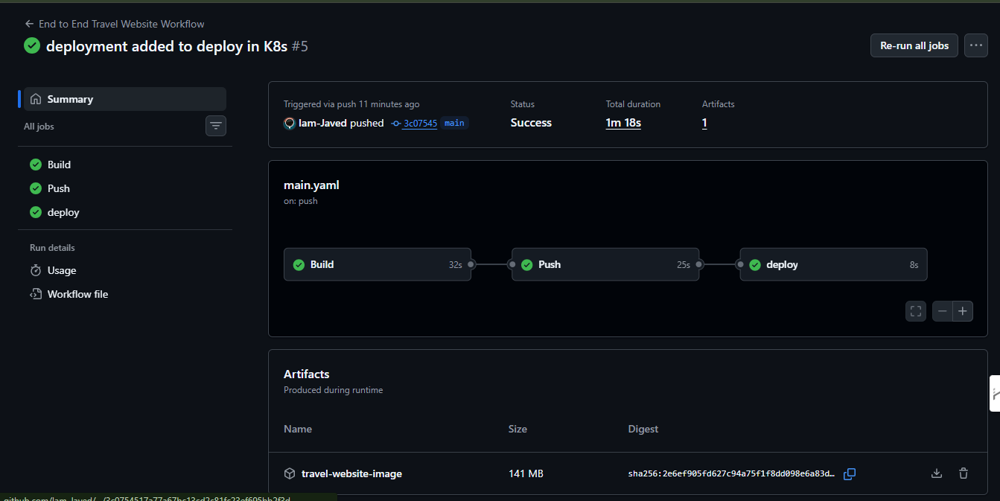
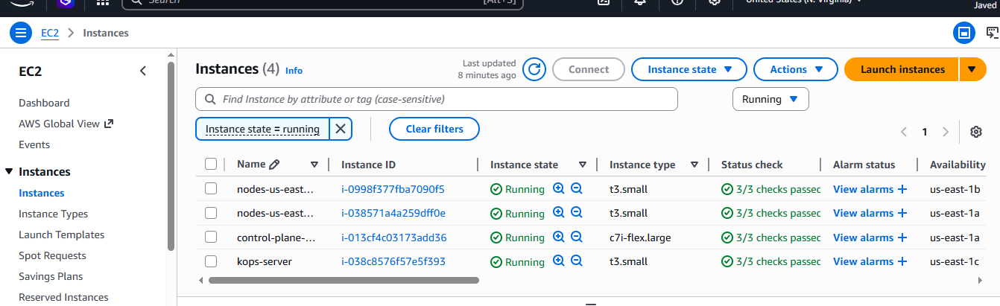
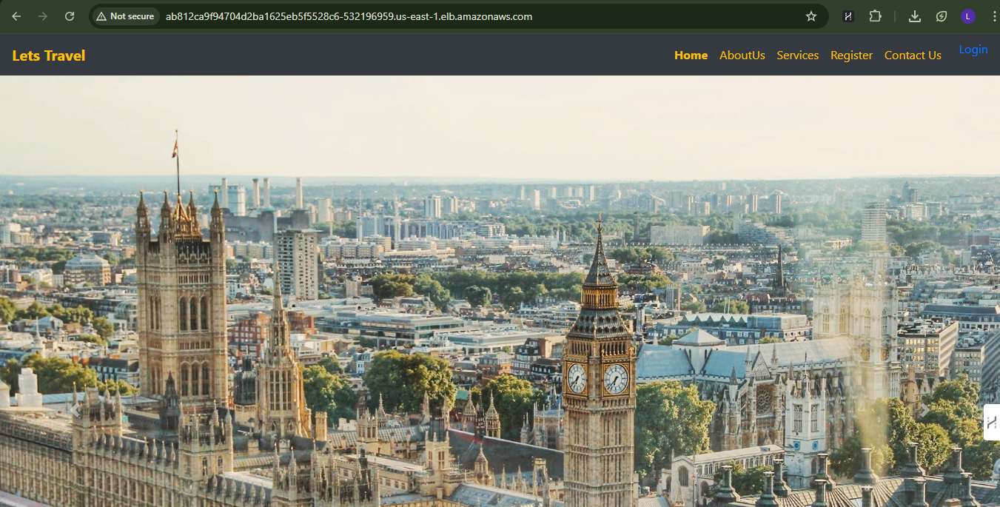

# 🌍 End-to-End Travel Website – CI/CD to Kubernetes using GitHub Actions & kOps

A complete DevOps pipeline that builds a Docker image, pushes it to Docker Hub and deploys the application to a Kubernetes cluster created using kOps on AWS.

find the images FYR

**Workflow**


**k8s cluster**


**website**


This project demonstrates a real-world CI/CD workflow using

**GIT**
**VS Code**
**GitHub**,
**Docker**,
**Kubernetes** and
**Amazon Web Services**.

---

## ✨ Project Highlights

✔ Dockerized travel website application
✔ CI pipeline using GitHub Actions
✔ Image pushed to Docker Hub
✔ Automated deployment to a Kubernetes cluster
✔ Cluster created using kOps on AWS
✔ External access using Kubernetes LoadBalancer Service

---

## 🏗 Architecture Overview

```
Developer Push → GitHub Actions
                ↓
         Docker Image Build
                ↓
         Push to Docker Hub
                ↓
      kubectl (GitHub Runner)
                ↓
     Kubernetes Cluster (kOps on AWS)
                ↓
         Public LoadBalancer URL
```

---

## 🧰 Tech Stack

| Component            | Tool           |
| -------------------- | -------------- |
| Source Control       | GitHub         |
| CI/CD                | GitHub Actions |
| Containerization     | Docker         |
| Container Registry   | Docker Hub     |
| Orchestration        | Kubernetes     |
| Cluster Provisioning | kOps           |
| Cloud                | AWS            |

---

## 📁 Repository Structure

```
.
├── docker/
│   └── Dockerfile
├── k8s/
│   ├── deployment.yaml
│   └── service.yaml
└── .github/
    └── workflows/
        └── travel-website.yml
```

---

## 🚀 CI/CD Workflow

The pipeline is implemented using GitHub Actions and contains three stages:

### 1️⃣ Build Stage

* Checks out the source code
* Builds the Docker image
* Saves the image as an artifact

### 2️⃣ Push Stage

* Downloads the image artifact
* Logs in to Docker Hub
* Tags the image
* Pushes the image to Docker Hub

### 3️⃣ Deploy Stage

* Connects to the Kubernetes cluster using kubeconfig
* Applies Kubernetes manifests
* Deploys the new application version

---

## 🔐 Secrets Used

All secrets are stored in the GitHub **environment** named `Prod1`.

| Secret Name       | Description                         |
| ----------------- | ----------------------------------- |
| `DOCKER_USERNAME` | Docker Hub username                 |
| `DOCKER_PASSWORD` | Docker Hub password or access token |
| `KUBECONFIG_DATA` | kubeconfig file of the kOps cluster |

---

## ☸ Kubernetes Deployment

### Deployment

The application is deployed using:

```
k8s/deployment.yaml
```

The container image used:

```
<docker-username>/travel-website:latest
```

### Service

The application is exposed using:

```
k8s/service.yaml
```

Service type:

```
LoadBalancer
```

This allows external access to the website.

---

## 🌐 How to Access the Website

After the pipeline finishes successfully:

Run:

```
kubectl get svc
```

You will see:

```
travel-website-service   LoadBalancer   <CLUSTER-IP>   <EXTERNAL-IP>
```

Open the following in your browser:

```
http://<EXTERNAL-IP>
```

This is your live travel website running on Kubernetes.

---

## 🔍 Verification Commands

Check pods:

```
kubectl get pods
```

Check deployment:

```
kubectl get deployment
```

Check service:

```
kubectl get svc
```

---

## 🔄 CI/CD Workflow Trigger

The pipeline runs when:

* Code is pushed to the `main` branch
* A pull request is created to `main`
* Manually triggered using workflow_dispatch
* Scheduled daily using cron

---

## 🔐 Security Note

The GitHub Actions pipeline does **not** access the AWS account directly.

It only communicates with the Kubernetes API server using the provided kubeconfig.

The access level is limited to the permissions defined inside the kubeconfig.

---

## 🧠 Learning Outcome

This project demonstrates:

* Real-world CI/CD pipeline design
* Docker image lifecycle management
* Artifact based workflows
* Kubernetes deployment automation
* kOps based cluster usage
* Secure usage of GitHub environment secrets

---

## 📌 Future Improvements

* Use image tags based on Git commit SHA instead of `latest`
* Add rollout verification after deployment
* Add Helm based deployments
* Introduce Ingress and TLS
* Add monitoring and logging stack

---

## 👨‍💻 Author

**Javed**

Windows Administrator → Aspiring DevOps Engineer
Hands-on project focused on real production-style DevOps workflows.
